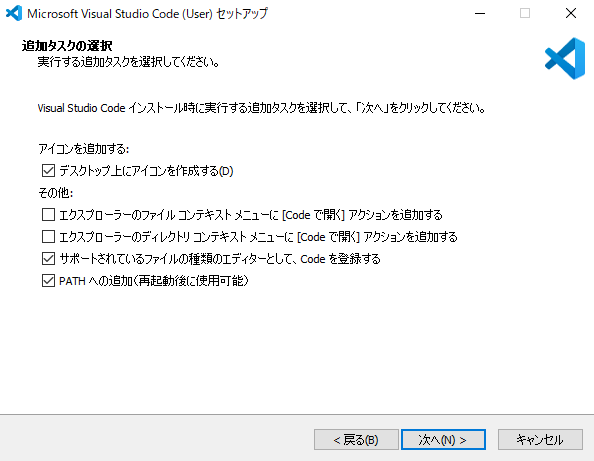
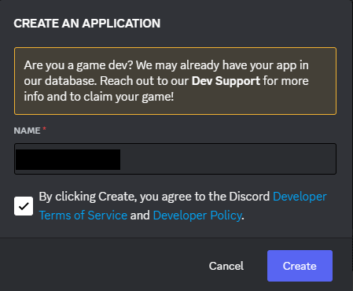
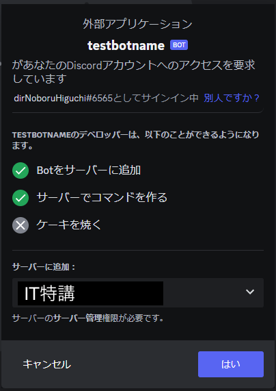

# DiscordBotをつくろう！研修ガイド

今日から始まる2日間の応用研修ではDiscordBotアプリ開発をしてもらいます。 
手元で動かせる身近なアプリ開発経験を通して、システム開発の面白さを少しでも感じてもらえたら嬉しいです。  

## 1. はじめに

基礎研修で習得したPythonプログラミングの知識を活かして、実際に動作するプログラムを作ります。（コンピューター上で動作する、ある目的と遂行するために作られたプログラムをアプリケーションプログラム=アプリケーション=アプリといいます。）  
実際の動作するアプリケーションと一口に言っても、ツールやWebアプリなど様々ありますが、今回は比較的かんたんに作れるDiscordBotアプリを作ることとします。

また、作っていくにあたって、せっかくなので、実際の現場でも利用するような開発ツールも導入してみたいと思います。  
ツールの詳細については、検索したり、質問しながら習得していってください。  
今回の研修を通して、開発のススメ方や開発のツールについてイメージをつけ、また開発の楽しさを感じてもらえたら嬉しいです。

### :smile: Discordとは

ボイスチャットやテキストチャット、画面共有などを使ってコミュニケーションするためのコラボレーションツールです。  
同様の目的で仕事の現場では Teams や Slack などがよく使われますが、今回の研修では誰でも簡易に使えることから Discord を選択しました。

### :smile: DiscordBotとは

Discord のテキストチャットに自分の作ったプログラムを設定することで利用できる、Botアプリです。  
誰かの発言や、Botへの命令に応じて処理を実行します。  

## 2. 全体像について

全体像については以下のとおりです。
1. GitHubから今回利用するソースコードをダウンロードし
2. VSCodeでソースコードを編集し、
3. ローカルPCでDiscord Botを起動し
4. Discord 上でBotが動作するかを確認します

なので、まずは
- `Discord`: コミュニケーションサービス

のアカウントを作成し

- `Git for Windows`: gitコマンドを扱えるようにするツール
- `Visual Studio Code(VS Code)`: ソースコードを編集するためのツール
- `Python`: プログラムを実行する環境

のインストールを行います。  
その後、開発として
- ソースコードのダウンロード
- プログラムの実行
- プログラムの改修

を行います。


## 3. 環境構築
***<span style="color: red">※ Discordには機密情報・個人情報は絶対に入れないこと（迷ったらチューターに問い合わせ）</span>***

### 3-1. アカウント作成

#### 3-1-1. Discordのアカウント作成
1. 講義中に展開された招待URLをクリックし、Discordの招待画面を開く  
2. ニックネームに自分の氏名を入力して「はい」をクリックする  
   1. nicknameは他の人がわかりやすいように氏名等（メアドの前のもの）にする
   2. 
3. reCAPTCHA (「私はロボットではありません」のやつ) をクリアする  
   1. 
4. メールアドレスとパスワード入力画面で 会社 のメールアドレスと任意のパスワードを入力して「アカウントを作成する」をクリックする  
   1. 
5. 登録認証用メールが届くので認証する

### 3-2. ツールのインストール

#### 3-2-1. Git For Windows
1.  [このURL](https://git-scm.com/download/win)をクリック
2. 『64-bit Git for Windows Setup』をクリックしGitのインストールファイルをダウンロードする
3. ダウンロードしたファイルを実行する
4. 基本的にはそのまま「Next」で良いが、改行コードの設定（以下の画像参照）では`Checkout as-is, commit Unix line endings`を選択する（その他の設定はデフォルトのままでOK）  
  
5. インストールが終わったら『Finish』  
  

#### 3-2-2. Visual Studio Code(VS Code)のインストール
1. [このURL](https://code.visualstudio.com/)をクリック
2. 下のページが開くので①、②の順にクリックしてインストールファイルをダウンロードする  
     
3. ダウンロードしたインストールファイルを実行する  
4. 『同意する』を選択し『次へ』  
     
5. それぞれ『次へ』  

  
6. 『次へ』（任意で『デスクトップ上にアイコンを作成する』をチェックしても良い）  
     
7. 『インストール』  
     
8. 処理が完了するまで待つ  
     
9.  『完了』  
     

#### 3-2-3. VS Code 拡張機能のインストール
1. VS Codeが実行されると以下の画面が開く  
   
2. 『拡張機能』ボタン①を押し、検索欄②に『japanese』と入力する。  
   一番上に出てくる日本語言語パックの『Install』③  をクリックする
     
3. 右下に出てくる『Change Language and Restart』を押す  
     
4. VS Codeが再起動し、日本語化される。  
   同様の手順で、下の拡張機能もインストールする。 (Restart のダイアログが出たら Restart する。出ないときはそのまま継続しても良い)  
* Python Extension Pack（Pythonの開発環境）
* indent-rainbow（見た目の調整）
* zenkaku（見た目の調整）
5. インストールが終わったらVS Codeを閉じる(Windowを最小化するのではなく、アプリを終了する)

#### 3-2-4. Python のインストール

1. [このURL](https://www.python.org/)をクリック
2. 下のページが表示されるので『Downloads』タブから『Python 3.11.3』ボタンを押し、Pythonのインストーラをダウンロードする  
  
3. ダウンロードしたインストーラを実行する
4. 『Customize installation』をクリックする  
  
5. 『py lancher』のチェックを外し『Next』  
  
6. 『Add Python to enviroment variables』をチェックし『Install』  
  
7. Install が完了したら『Close』
7. VS Codeを起動する。
8. 『Ctrl』+『@』でターミナルを開き、`python --version`を実行する。`Python 3.11.3`と表示されればOK
  

## 4. 開発 

### 4-1. リポジトリからファイルをクローンする
VS Codeのターミナルで以下のコードを実行する  
※ ターミナルを閉じていたら『Ctrl』+『@』でターミナルを開く

#### 4-1-1. 作業ディレクトリを作成
   ```ps
   mkdir C:\workspace
   ```
#### 4-1-2. 作業ディレクトリに移動 
   ```ps
   cd C:\workspace
   ```
#### 4-1-3. リポジトリをクローン (インターネット上のプログラムのダウンロード)
   ```ps
   git clone https://github.com/dir-tajiisam/discord-bot-sample
   ```
   ```ps
   cd ./discord-bot-sample
   ```
#### 4-1-4. 仮想環境にライブラリをインストールする
   ```ps
   pipenv sync
   ```

### 4-2. プログラムの実行

プログラムの実行には予め Discord に Botの登録が必要です。以下の手順で Botを登録します。  
以下の手順を始める前に、事前に Discord にログインしておいてください。

#### 4-2-1. Discord Bot用アカウントの作成
1. [このURL](https://discord.com/developers/applications/)をクリック
2. 右上の『New Application』をクリック
3. Bot名に「メールアドレスの@の前_bot」を入力し、規約とポリシーに同意して『Create』をクリックする  
     
4. アカウント管理画面が表示される
     
5. 左のメニューから『Bot』を選択し、表示された画面で『Reset Token』ボタンを押してトークンをリセットする。  ※このトークンは後ほどソースコード内で利用する
     
7. ブラウザに戻り「Privileged Gateway Intents」の権限を付与するため、以下3項目のチェックをONにする  
- PRESENCE INTENT
- SERVER MEMBERS INTENT
- MESSAGE CONTENT INTENT
  

#### 4-2-2. Discord Botをサーバに参加させる
1. 左のメニューから『OAuth2』を選択し、下に表示される『URL Generator』を選択
2. 『SCOPES』内の『Bot』にチェックする  
  
3. 画面を下にスクロールするとBotに与える権限のリストが表示されるので、必要な権限にチェックを入れる  
  
   必要な権限は以下
   * Send Messages
4. 更に下にスクロールすると認証用URL（『GENERATED URL』）が表示されているのでアクセスする  
     
5. アクセスして表示された画面でBotを追加するサーバーを選択し、『はい』を押す  
   （先ほど作成したサーバーにBotを追加する）  
     
6. 権限を与えることを承認し、スパム対策認証をするとBotがサーバに追加される

#### 4-2-3. Discordにテキストチャンネルを作成する
1. Discord のメニューに有る自身のグループの『＋』をクリックしチャンネルを作成する  
     
2. Text チャンネルを「メールアドレスの@の前_channel」の名前で作成する  
     
3. 以降のプログラムではこのチャンネルを使用する

#### 4-2-4. プログラムの実行
1. VS Code を開く
2. Fileメニューの「Open Folder...」からソースコードのディレクトリを開く(C:\workspace\discord-bot-sample)
     
     
3. 「.env」ファイル を開き TOKEN/SERVER_ID/CHANNEL_ID を記載する
     
4. 『Ctrl』+『@』でターミナルを開き以下のコマンドを実行する
   ```ps
   python app.py work1
   ```
1. 以下の表示が出れば成功（Botが起動した状態）
     
6. Botを止めるときはターミナル上で『Ctrl』+『C』を押す


## 5. 課題

[課題5(Work1.md)を参照](./Work1.md)


## 6. アンインストール手順
### 6-1. Discordアカウントを削除
1. ユーザー設定->マイアカウント->編集->アカウントを削除する

### 6-2. アンインストール
1. Windowsの『アプリと機能』を開く
2. 以下をアンインストールする
   * Git
   * Microsoft Visual Studio Code (User)
   * Python 3.11.3 (64-bit)
   * Python Launcher