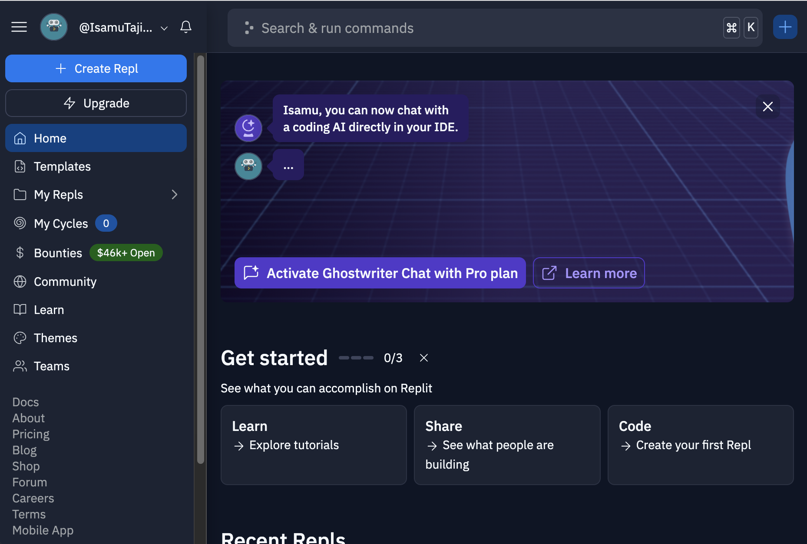
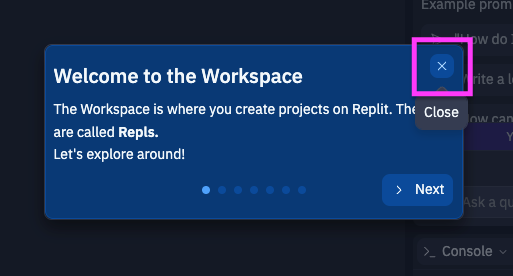

## 5. 課題

***<span style="color: red">※ Discordには機密情報・個人情報は絶対に入れないこと（迷ったらチューターに問い合わせ）</span>***

### 課題 5 自分で考えたBotをプログラムしてみよう

🚨忘れずに🚨  
修正したあとは、VSCodeのターミナルから『Ctrl』+『C』でプログラムを停止し、以下のコマンドで実行してください
```ps
python app.py work5
```

- 修正するファイル
  - work5/ にあるファイルのいずれか
- やること
  - これまでの知識を元に自分で考えたBotをプログラムしてみよう！

---
### 課題 6 自分で考えたBotをサーバーで動かそう

***<span style="color: red">※ コードに機密情報・個人情報が入っていないことを今一度確認しよう（迷ったらチューターに問い合わせ）</span>***

#### Repl.it にアカウントを作成する

1. https://replit.com/ にアクセスする
   1. 
2. Google認証を選択する
   1. 
3. 会社メアドで作成したGoogleアカウントでログインする
   1. 
4. 「For personal use」を選択する
   1. 
5. 「New to coding」を選択する
   1. 
6. 「No, I got this.」を選択する
   1. 
7. Replitのトップページが表示される
   1. 

#### Repl.it で既存のプロジェクトをFork（Import）する

1. サンプルプロジェクトを開く
   1. https://replit.com/@IsamuTajima/Discord-Bot-Sample
2. 「Fork」を選択する
   1. 
3. 「Name」を適当な値に変更し、「Fork Repl」を選択する
   1. 
4. Forkに成功して、画面が遷移する。ダイアログが出ていたら「×」で閉じる
   1. 
5. 試しに画面上部の「Run」を押し、右下の「Console」にTOKENが無い旨のエラーが出ることを確認する
   1. `KeyError: 'TOKEN'`
   2. 

#### Repl.it で環境変数（TOKEN, SERVER_ID, CHANNEL_ID）設定する

1. 左下の「Tools」エリアの「Secrets」ボタンを選択する
   1. 
2. （おそらく）右上に「Secrets」タブが開くので、「Got it」を選択する
   1. 
3. まずはTOKENを登録する。入力が終わったら「Add new secret」
   1. key: 「TOKEN」
   2. value: DiscordのBotのTOKEN
   3. 
4. もし、チュートリアルっぽいのが挟まったら、「Skip this step」を選択する
   1. 
4. 続いてSERVER_IDを登録する。入力が終わったら「Add new secret」
   1. key: 「SERVER_ID」
   2. value: DiscordのサーバーID
   3. 
5. 最後にCHANNEL_IDを登録する。入力が終わったら「Add new secret」
   1. key: 「CHANNEL_ID」
   2. value: Discordで自分が使っているチャンネルID
   3. 
6. すべて登録が終わるとこの様になる
   1. 

#### Repl.it のソースコードを更新する

1. 画面左側の「Files」エリアの「custom」フォルダを開く
2. 自分が作成したソースコードで中身をそれぞれ上書きする(修正していないものはそのままでOK)
   1. on_message.py
   2. on_reaction.py
   4. on_ready.py
   3. on_slash.py

#### Repl.it でプログラムを実行する

0. 同時に2つ起動すると良くないので、VSCodeのターミナルから『Ctrl』+『C』でプログラムを停止しておく
1. 画面上部の「Run」を押し、右上の「Webview」が開き「Hello. I'm alive」と表示されることを確認する。Webviewに表示されたURLをコピーしておく
   1. 
2. スプレッドシートにアクセスし、自分の名前の行の「URL」列に先程コピーしたURLを貼り付ける
   1. ついでに、スプレッドシートの「repl.itのURL」列に、作業している画面のURL（https://replit.com/@IsamuTajima/Discord-Bot-Sample のようなもの）を貼り付ける
   2. ついでに、スプレッドシートの「DESCRIPTION」列に、自分のBotの説明を書いておく
3. 終わったらチャーターにチェックしてもらう

:tada:以上です！おつかれさまでした！:tada: